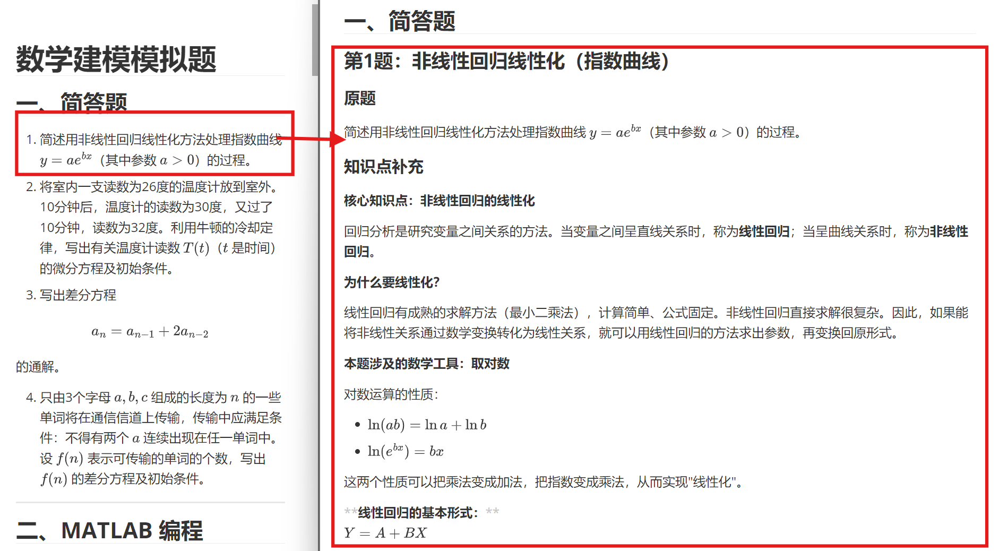

# 期末周速成 SKILL


## 简介

这是一个简单好用的SKILL，能够帮一个学期都没过听课的你快速复习至及格水平。
采取最简单有效的应试策略，你只需提供一份或者多份试卷，该技能即可逐题生成结构化的复习资料，涵盖：

- **原题呈现** - 结合原题讲解
- **知识点补充** - 完完全全从零讲起，补充足够的前置知识，逐步延伸到本题所需深度，保证任何基础的学生都能理解
- **题目讲解** - 手把手带你结合上述知识点讲解，分析题意、建立模型、求解并解读结果，让你彻底学会此类题目

因此，只要你提供的试卷的题型能涵盖所有可能的题目类型，本技能就能帮助你快速复习至及格水平乃至更高的成绩，这就是最好的应试策略。

## 部分实际效果参考



## 支持的 AI IDE

本技能兼容以下支持 Claude Skills 规范的 AI IDE：

| IDE              | 安装路径          | 说明                    |
| ---------------- | ----------------- | ----------------------- |
| **Trae**         | `.trae/skills/`   | 国产 AI IDE，原生支持   |
| **Claude Code**  | `.claude/skills/` | 官方 CLI 工具，规范源头 |
| **其他兼容 IDE** | 同上或类似路径    | 遵循 Skills 规范即可    |

## 快速开始

### 1. 安装技能

将本项目中的 skills 目录复制到你的项目根目录下：

```
你的项目/
└── .trae/              # Trae 用
    └── skills/
        └── zero-to-pass/
            └── SKILL.md
```

如果使用 **Claude Code**，目录名改为 `.claude`；其他 IDE 请参照其文档确定技能安装路径。

### 2. 准备试卷

将需要复习的试卷整理成 Markdown（`.md`）或纯文本（`.txt`）格式，放入你的项目目录中。

推荐先借助豆包等工具将图片/PDF 转换为 Markdown 格式，再提交给本技能。

### 3. 调用技能

在 AI IDE 中打开项目，输入提示词调用本技能：

```
@zero-to-pass 帮我复习 试卷文件.md
```

技能会自动逐题生成复习资料并写入 Markdown 文件中，推荐使用Deepseek v4 pro，讲解能力体感最好。

## 项目结构

```
.
├── .trae/
│   └── skills/
│       └── zero-to-pass/
│           └── SKILL.md       # 核心技能定义文件
├── images/                      # 存放 README 图片
│   └── (示例图)
├── README.md                   # 本文件
└── .gitignore
```

## 更新计划

- [ ] 支持用户上传试卷答案参考，提供更贴近老师实际教学内容的资料

## 贡献指南

本项目存在很多可以改进的地方，欢迎提交 Issue 或 Pull Request！

你可以通过以下方式参与：

- 优化技能提示词以改进生成质量
- 报告生成中的错误或异常
- 提出新功能建议

## 许可

本项目采用 MIT 许可证。
